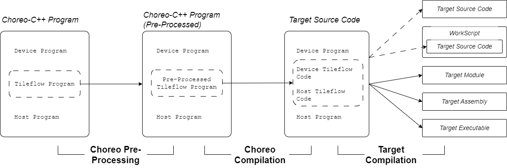
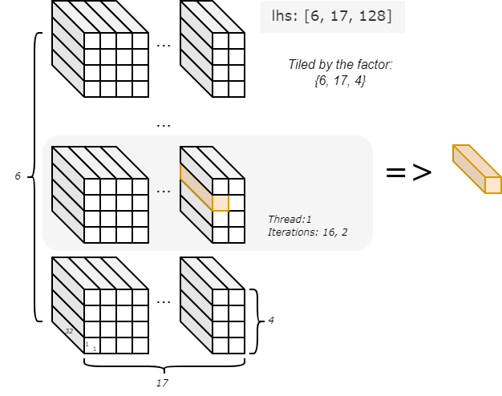

## Basics
A typical **Choreo-C++** program is composed of multiple parts depending on the target platform it targets to. For a Choreo-supported platform, which is usually a programming environment utilizing the heterogeous parallel hardware, the Choreo-C++ program normally contains three parts: The *Device Program*, the *Host Program*, and the *Tileflow Program*.

### Host, Device and Tileflow
The below code showcases a Choreo-C++ program targeting to *Topscc*/*CUDA*:

```choreo
// Device program: normally run on GPU/NPU/GCU
__device__ void device_function(...) {
  // high-performance kernel implementation
}

// Tileflow program: ochestrating data movement
__co__ void choreo_function(...) {
  // ... choreo code ...
  device_function(...);
  // ...
}

// Host program: normally run on CPU
void main() {
  // ... prepare data ...
  choreo_function(...);
  // ...
}
```

Let's have a quick review of each part:

**Host Program**

The *Host Program* typically serves as the entry of the *Choreo-C++ module/program* and the caller of the *Tileflow Program*(*Choreo Functions*). Written in standard C++, it runs on the CPU and is responsible for managing the overall workflow of the heterogeneous application.

In a simple high-performance kernel implementation, the programmers normally prepare necessary data in the host program to invoke Choreo functions, which perform computations with the data (in parallel), and obtain the return values to step further.

**Device Program**

In most cases, it defines the "computation-intensive" operations executed on the target device. In the above example, the device function is prefixed with `__device__`, indicating it is a device function with only the execution environment of the heterogenous device. Similar to the *Host Program*, Choreo would not alter the content of *Device Program*.

**Tileflow Program**

The *Tileflow Program*, which are composed of choreo functions (prefixed with `__co__`), is the heart of *Choreo-C++* programs. It is responsible for orchestrating data movement among different host/devices, and also among different levels of storages of single devices. In a typical workflow, the tileflow program moves the data to a proper storage place (buffer) and call *device programs* to conduct computations. When the work is done, it move the result (buffer) back to host.

### Tileflow Program in the Compilation Workflow
To better understand how the different parts of Choreo-C++ program get into work, we need to dive into the compilation workflow. The below figure illustrates the full compilation process:



In Choreo's workflow, its major target is to transpiles the *tileflow program* into target code form. As observed from the figure, after a simple pre-processing step, Choreo transform the *pre-processed tileflow program* into some host and device source code. Choreo then mixes them up with the user provided code to generate the *Target Source Code*, which can be fully compiled by the *target compiler*.

Consequently, Choreo appears as a source-to-source compiler but equiping with end-to-end compilation capability. Furthermore, it supports both the

- _Single Source Programming Model_: like *CUDA*/*Topscc*, where the *target compiler* allows device and host programs appears in a single source file for *target compilation*.
- _Separate Source Programming Model_: like *Factor*/*OpenCL*, the host and device code must be target-compiled in separate.

Since the two models differs in compliation workflow, Choreo requires to wrap the *Device Program* if the target platform only support _Separate Prgoramming Model_. An *Factor*-targeted *Choreo-C++* code example showcases the situation:

```choreo
__cok__ {
  void device_function(...) { ... }
} // end of __cok__

__co__ void choreo_function(...) { ... }

void foo() { ... }
```

The Factor compiler requires the device program (`devie_function` in the code) be stored in a separate file rather than the host program. In this case, the `__cok__ {}` wrapper allows Choreo compiler able to handle user-provided device code properly. The wrapper assists Choreo to manage device and host code separation from the single Choreo source. So do not be surprise when you find `__cok__` for certain target code. That is the payment of integrating _Separate Source Programming Model_ support.


## A Full Choreo-C++ Code Example
A full *Choreo-C++* code example to perform element-wise addition on top of two arrays (with same size and element type) is listed as below:

```choreo
// Device Program
__device__ void kernel(int * a, int * b, int * c, int n) {
  for (int i = 0; i < n; ++i) c[i] = a[i] + b[i];
}

// Tileflow Program
__co__ s32 [6, 17, 128] ele_add(s32 [6, 17, 128] lhs, s32 [6, 17, 128] rhs) {
  s32[lhs.span] output; // Use same shape as lhs

  // first `parallel` indicates the kernel launch
  parallel p by 6 {
    with index in [17, 4] {
      foreach index {
        lhs_load = dma.copy.async lhs.chunkat(p, index) => local; // Tiling factor
        rhs_load = dma.copy.async rhs.chunkat(p, index) => local;
        wait lhs_load, rhs_load;

        local s32[lhs_load.span] l1_out;

        // Call kernel with loaded data
        call kernel(lhs_load.data, rhs_load.data, l1_out, |lhs_load.span|);

        // Store result back to output
        out_store = dma.copy.async l1_out => output.chunkat(p, index);
        wait out_store;
      }
    }
  }
  return output;
}

// Host Program
int main() {
  // Define data arrays
  choreo::s32 a[6][17][128] = {0};
  choreo::s32 b[6][17][128] = {0};

  // Fill arrays with data
  std::fill_n(&a[0][0][0], sizeof(a) / sizeof(a[0][0][0]), 1);
  std::fill_n(&b[0][0][0], sizeof(b) / sizeof(b[0][0][0]), 2);

  // Call Choreo function (data movement and device kernel execution)
  auto res = ele_add(choreo::make_spanview<3, choreo::s32>((int*)a, {6, 17, 128}),
                     choreo::make_spanview<3, choreo::s32>((int*)b, {6, 17, 128}));

  // Verification: check correctness of results
  for (size_t i = 0; i < res.shape()[0]; ++i)
    for (size_t j = 0; j < res.shape()[1]; ++j)
      for (size_t k = 0; k < res.shape()[2]; ++k)
        if (a[i][j][k] + b[i][j][k] != res[i][j][k]) {
          std::cerr << "result does not match.\n";
          abort();
        }

  std::cout << "Test Passed\n" << std::endl;
}
```

The subsequent sections will explain the different code parts.

### Host Program

As we introduced, the **host program** is the entry point of the *Choreo-C++* program. It is typically written in standard C++ and serves as the control center. Let us repeat the code for convinience:

```choreo
int main() {
  // Define data arrays
  choreo::s32 a[6][17][128] = {0};
  choreo::s32 b[6][17][128] = {0};

  // Fill arrays with data
  std::fill_n(&a[0][0][0], sizeof(a) / sizeof(a[0][0][0]), 1);
  std::fill_n(&b[0][0][0], sizeof(b) / sizeof(b[0][0][0]), 2);

  // Call Choreo function (data movement and device kernel execution)
  auto res = ele_add(choreo::make_spanview<3, choreo::s32>((int*)a, {6, 17, 128}),
                     choreo::make_spanview<3, choreo::s32>((int*)b, {6, 17, 128}));

  // Verification: check correctness of results
  for (size_t i = 0; i < res.shape()[0]; ++i)
    for (size_t j = 0; j < res.shape()[1]; ++j)
      for (size_t k = 0; k < res.shape()[2]; ++k)
        if (a[i][j][k] + b[i][j][k] != res[i][j][k]) {
          std::cerr << "result does not match.\n";
          abort();
        }

  std::cout << "Test Passed\n" << std::endl;
}
```

The `main` function is a standard C++ function except for the usage of Choreo APIs. In this program, we first define two arrays `a` and `b`, and fill them with different values. Then the API `choreo::make_spanview` is used to attach the shape information with the data.

`choreo::make_spanview` is a function template, where it takes `Rank`, `ElementType` as its template parameters, together with a data `pointer` and a `std::initializer_list` as the function parameters.

The `choreo::make_spanview` API is declared as below:

```cpp
template <size_t Rank, typename ElementType>
spanned_view<T, Rank> make_spanview(ElementType* ptr, std::initializer_list<size_t> init);
```

We repeat the usage here for your reference:
```cpp
choreo::make_spanview<3, choreo::s32>((int*)a, {6, 17, 128})
```

This API is essential to connect host code to the Choreo function. In essence, any Choreo input buffer (named the `spanned` data) is always associated with its shape, which makes Choreo able to guarantee shape safety at compile and run.

**Note:** The most significant dimension value comes first in the `initializer_list` depicted shape. Thus, a shape of `{6, 17, 128}` is literally given in the same order of C multi-dimensional array like `a[6][17][128]`.

In the example code, choreo function `ele_add` is then called. It calculates the sum element-by-element in parallel. Thereafter, the host code take the result buffer `res` and apply its verification.

There is one detail worth noticing, that the output of choreo function is of type `choreo::spanned_data`. Contrary to `choreo::spanned_view`, which does not own buffer memory of the data it points to, `choreo::spanned_data` is the buffer owner. In this way, it guarantees the later data verification process is applied on valid memory. The `choreo::spanned_view` is built with rich APIs. It does not only allow C-style array indexing, but also supports shape query via member function `.shape()`.

Similarly, the most significant dimension is listed as the first element in this array of shape (`res.shape()[0]` in this case). In essence, Choreo code follows a '**most-significant-dimension-majored**' ordering, or in some term '**row-majored**' ordering, where the first dimension varies slowest.

### Device Program

The **device program** defines the computational logic that will be executed on the target device (e.g., GPU, CPU). The kernel is designed to operate on input data, process it in parallel, and produce the output.

We repeat the code as below:

```choreo
__device__ void kernel(int * a, int * b, int * c, int n) {
  for (int i = 0; i < n; ++i) c[i] = a[i] + b[i];
}
```

As described ahead, for a target only support _Separated Source Programming Model_, the code may be wrapped within a `__cok__` block, be like:

```choreo
__cok__ {
  extern "C" void kernel(int * a, int * b, int * c, int n) {
    for (int i = 0; i < n; ++i) c[i] = a[i] + b[i];
  }
} // end of __cok__
```

This is the equivalent code for *Factor target*. An `extern "C"` annotation replaces the `__device__` keyword used in *Topscc*/*CUDA* target since *Factor* requires C-linkage for the device functions only.

In general, Choreo's device programming varies on targets depending on the target supports. Taking *Topscc*/*Factor* target as example, it allows the use of either *TCLE (Target Compiler Language Extension)*, *intrinsic function*, etc., to fully utilize the computational power of the parallel target hardware.

And the programmer should be aware that the device program follows a Single-Program-Multiple-Data (SPMD) paradigm, where multiple instances of the same device program are executed in parallel. This paradigm is effecient for processing data in parallel hardware. However, in Choreo, it is not necessary to program data movement across host-device, and among multiple storage levels in device. All such work can be programmed easily with the *Tileflow Program*.

### Tileflow Program

The *Tileflow Program* consists of *Choreo functions*. As described, it manages the movement of data between the host and the target device and ensures that data is copied correctly across different storage locations.

Let us repeat the code for convinience:

```choreo
__co__ s32 [6, 17, 128] ele_add(s32 [6, 17, 128] lhs, s32 [6, 17, 128] rhs) {
  s32 [lhs.span] output; // Use same shape as lhs

  // first `parallel` indicates the kernel launch
  parallel p by 6 {
    with index in [17, 4] { // Tiling factors
      foreach index {
        lhs_load = dma.copy lhs.chunkat(p, index) => local;
        rhs_load = dma.copy rhs.chunkat(p, index) => local;

        local s32 [lhs_load.span] l1_out;

        // Call kernel with loaded data
        call kernel(lhs_load.data, rhs_load.data, l1_out, |lhs_load.span|);

        // Store result back to output
        dma.copy l1_out => output.chunkat(p, index);
      }
    }
  }
  return output;
}
```

In this code, the `__co__` prefixed Choreo function accepts two input `lhs`, `rhs`, both with the shape of `[6, 17, 128]` and element type of `s32` (signed 32-bit integer). And the output is defined as the same type of input.

The `parallel p by 6 {...}` block indicates the code enbraced runs in parallel. To be specific, there are 6 instances of the code are parallelly executed. If you are familiar with the heterogeneous programming model like *CUDA*/*Topscc*, the term *kernel launch* describes what is happening. To be simple, programs may consider that the execution environment is changed from host to device.

Inside the `parallel-by` block, a `with-in` block binds symbol `index` will two values `17` and `4`. In Choreo, `index` is called the *bounded ituple* with two *bounded variable*s, which can be used for the `foreach` statements. (We will explain the `bounded variables` in later chapters).

The `foreach index {...}` statement is equivalent to C code like:

```
for (int x = 0; x < 17; x++)
  for (int y = 0; y < 4; y++) { ... }
```

Within foreach, the `dma.copy` statement described how the data movement. Taking `lhs_load = dma.copy lhs.chunkat(p, index) => local;` as example,

- The symbol `lhs_load` in Choreo is called the **future** of the DMA operation, which gives the information related to DMA destination. 
- `dma.copy` indicates it invokes direct a DMA data tranfer without transformation the shape of the data. The expression on the left-hand-side of `=>` represents the DMA source, and the right-hand-side represents the destination.
- In this case, the destination is specified as a `local` buffer, which will be allocated automatically by Choreo compiler.
- The source expression `lhs.chunkat(p, index)` is named as the `chunkat` expression of Choreo. In this case, `p, index` is a tiling factor of buffer `lhs`. As `lhs`' shape is `[6, 17, 128]`, and the upper bound of `p, index` are `6, 17, 4`, it indicates a data chunk size is `1, 1, 32` (`6/6, 17/17, 128/4`). In each iteration, one signle data chunk is used as source, but the exact chunk is decided by current values of `p, index`. For example, in parallel thread 1, and the iteration of `16, 2`, the chunks' offset is set to be `1, 16, 2`.  
This is illustrated in the below figure:



With the DMA statement, different chunks of data tiled from `lhs` are moved from host to device's `local` memory iteratively and parallelly. Similarly, the DMA statement manage `rhs` as small chunks and move it to `local` memory for processing.

Next, the statement `local s32 [lhs_load.span] l1_out;` defines a per-parallel-thread buffer. Note here it takes the shape from expression `lhs_load.span`, which represents the tiled block. The buffer is utilized to save the output data in the consequent `call` statement. Next, the call invoke the device function named `kernel` for computations. When back, another DMA statement moves the output data from `local` buffer back to host. In this way, one iteration is done.

In this code, each parallel thread runs `17x4` iterations. And different iteration handles different `1x1x32` sized chunk of data. *Choreo program* terminates when all the parallel threads have finished all their iterations. It then returns the output buffer to its caller, the host program.

You may notice that Choreo code does not only abstract DMA to a higher level semantics, it also makes the iteration, tiling combined for easier use. This makes Choreo code neat. We will delve deeper into the Choreo's syntax and semantics in the following chapters to explore more.
