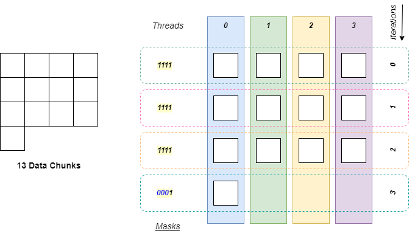

## Overview


## Mask the Parallel Threads

### Masking in SPMD
It is typically necessary to mask off some *parallel threads* in SPMD programming. For example, programmers often divide data into chunks for parallel or iterative processing. However, there may be a remainder that cannot be evenly distributed across all threads. In such cases, masking some threads is a proper way to leverage parallel hardware while maintaining correct functionality.



The figure aboves showcases a tiling of 13 data chunks, where 4 parallel threads are invoked for the processing of each chunk. In this case, 4 iterations are required to process all the data chunks. However, for the last iteration, only *thread-0* is required to work. You may observe the **thread mask** for each iteration are `1111`, except for the last iteration (`1000`). The thread mask is a combination of boolean bits, where `1` stands for **active**, and `0` stands for **inactive**. So in this case, only *thread-0* is set to be *active* to avoid unnecessary data chunk processing in the last iteration.

### Uniform and Divergence
Masking is an implementation-level concept. From the perspective of the SPMD programming, we typically claim the code that processes data chunks **diverges** because not all the thread instances execute the same code due to masking. And programmers should be aware of that their SPMD code is a combination of:

- **Uniform Code**: *All threads* execute the same code path.
- **Divergent Code**: Only the *masked threads* execute the *divergent* code path.

It is necessary to have the *divergent* code in SPMD code to handle different real-world requirements. And from a perspective of different programming paradigm, applying *divergent* code in SPMD programs can even mimic MPMD (Multiple Program Multiple Data) behavior. In MPMD, different threads execute different code. Therefore, *divergence* can extend SPMD to MDMP scope conceptually.

In Choreo, we are able to create divergent code via `inthreads` block. Let us dive into the detail.

## `inthreads`: Divergent Code with the Thread Mask
### Parallel Perspective of Tileflow Programs
In Choreo, a *divergent* code region is generated with the keyword `inthreads`, where a compare expression followed.

Let us have a look at the following example:

```choreo
__co__  void foo() {
  // sequential code

  // start of the SPMD code region
  parallel p by 6 {
    // some uniform code for all threads
    // ...
    inthreads (p <= 2) {
      // divergent code for thread 0, 1, 2 (thread-mask: 000111)
    }
    // threads are forced to be synchronized
    // some uniform code for all threads
    // ...
  }
  // end of the SPMD code region

  // sequential code
}
```

You may now re-examine Choreo tileflow programs from the perspective of parallelism. It consists of

- *Sequential Code*
- *SPMD-Styled Parallel Code* enclosed in `parallel-by` block, which consists of:
    - *Uniform Code*
    - *Divergent Code* enclosed in `inthreads` block.

In this example, `p <= 2` initiates the the *divergent code block*, where from the implementation perspective, it creates a thread mask of `000111`, which allows only thread `0`, `1` and `2` to execute the code inside. And thread `3`, `4` and `5` will skip this path. **All threads are forced synchronized after the `inthreads` block**. In this case, it implies thread `3`, `4`, and `5` waits for the completion of the others before stepping forward.

In Choreo, the `inthreads` block looks like a `if` conditional block in C/C++. However, `inthreads` explicit claims the code divergence, which is a concept in SPMD program, rather than the conditional block for sequential code. Therefore, the `inthreads` block:

- Can only appear in the SPMD code region, which is enclosed in the `parallel-by` block.
- Can only have a comparison result related to thread identifiers.

Choreo compiler has the checks for both the corrent comparison expression and `inthread`-block placement.

### Make it Asynchronous
Similar to the `parallel-by` statements, it is possible to make the threads with/without executing the divergent code be asynchronous. The following code showcases a example that conduct MPMD execution in the SPMD code:

```choreo
__co__  void foo() {
  parallel p by 6 {
    inthreads.async (p <= 2) {
      // divergent code for thread 0, 1, 2 (thread-mask: 000111)
    }
    inthreads.async (p > 2) {
      // divergent code for thread 3, 4, 5 (thread-mask: 111000)
    }
    sync.shared; // sync point
                 // all 'inthreads' paths must get executed
  }
}
```
In this example, it divides the parallel threads evenly into two sub-groups, without forcing synchronization after each `inthreads` block. In this way, threads in different groups are executed in parallel, mimicing a MPMD executing. However, the `sync.shared` statement established a **synchorinization point** for all threads. That makes sure code for both paths get executed after this *synchorinization point*.

## Masking for Multi-Levels
It is possible to mask threads for different parallel levels. The following code showcases an example:

```choreo
__co__  void foo() {
  parallel p by 3, q by 4 {
    inthreads (p < 2 && q == 0) {
      // divergent code for thread (0, 0), (1, 0)
      // thread-mask: 011-0001
    }
    inthreads (q == 1) {
      // divergent code for thread (0, 1), (1, 1), (2, 1)
      // thread-mask: 111-0010
    }
  }
}
```

In this code, we have two level of parallelism. The outer parallelization count is 3, while the inner parallelization count is 4. Here the `inthreads` predicate `p < 2 && q == 0` guard code for both parallel levels. For the outer parallelization, the allowd parallelization identity is restricted to `0` and `1`, while the allowd parallelization identify for the inner is restricted to `0` only. We also show the thread masks there in two levels, which are connected by '-'.

For the second `inthreads` predicate `q == 1`, it does not have any restriction for the outer parallel level. Therefore, all parallelization identities are allowed, as showed in the comment. As a consequent, programmers must be aware of the count of parallel levels to make sure the parallel threads that execute the divergent code is as expected.

## Implicit Masking
There are some code structures in Choreo that implies implicit masking. One typical situation is the multi-level `parallel-by` block. The below code showcases an example:

```
__co__  void foo() {
  parallel p by 6 {
    // parallel-level-0:
    //   as if implicitly masked 'inthreads (q == 0)'
    parallel q by 2 {
      // parallel-level-1:
      //   code here is for all threads
    }
    // parallel-level-0:
    //   code here is as if implicitly masked 'inthreads (q == 0)'
  }
}
```

In this example, there exists two-level of parallelization. The code inside `parallel p by 6` block but outside `parallel q by 2` blocks is only for *parallel-level-0*. However, for target like *CUDA*/*Topscc*, it could invoke 2 parallel threads in practise to execute either code inside *parallel-level-0* or *parallel-level-1*. Therefore, the *parallel-level-0*-only part is as if guarded with a C++ block `if (q == 0)`.


