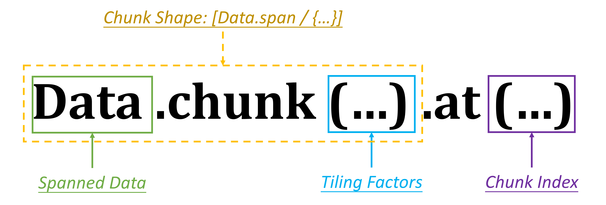

## Overview

## *Ubound* Operation
In last chapter, we learnt that a *bounded variable* defined by `parallel-by` or `with-in` statement is either an *integer* or an *ituple* with (a) bound(s). As the *bounded variable* has a *current value* together with a *upper-bound value*, we demonstrated how to use it to consturct loops in `foreach` blocks.

In Choreo, you may use the **ubound** operation to retrieve the upper bound of a bounded variable. *ubound* is an unary operation that prefix symbol `#` ahead of a bounded varable. For example:

```choreo
 with size in [32] {
   local u8 [#size, 16] a; // buffer shape: [32, 16]
   local u8 [size, 16] b; //  error in shape: [0, 16]
 }
```

Here, the local buffer `a` is shaped as `[32, 16]`, since `#size` is evaluated the upper-bound of `size`. However, as the declaration of `b` utilize the *current value* of `size`, it results in incorrect shape definition.

## Use `chunkat` Expression to Tile Data
In all the examples of the last section, the *data expression*s of *DMA statement* all utilize the *spanned* data, or *storage* annotation directly. However, to allow tiling at the DMA statement, Choreo use the **chunkat** expression. For example:

```choreo
__co__ void foo(f32 [36] input) {
  parallel p by 6 {
    dma.copy input.chunkat(p) => shared;
  }
}
```

In this example, it uses the built-in member function `.chunkat` to make a tile/block for the from expression of the DMA statement. Here, we call each block tiled a **chunk**. The `.chunkat(...)` data expression can be considered as a simpler form of `.chunk(...).at(...)`, where the semantic of each part is as show in below figure:



Taking The expression `input.chunkat(p)` that is equivalent to `input.chunk(#p).at(p)` as example, that:

- `input` is the *spanned data* to be tiled.
- `#p` indicates the **tiling factor**. It also indicates the total **chunk count** of each dimension to process. In this case, the 1D input is tiled by `6`, where `6` chunks are to be processed.
- `.chunk(#p)` decides the **chunk shape**. The chunk is 1D data tiled from `input`, where its size is the data *mdspan* divided by the *ubound* of the bounded variable. In this example, the shape of the chunk is `[input.span/#p]`, which results in a chunk shape of `[6]`.
- `.at(p)` decides the **chunk index**. In this case, `p` ranges between [0, 6), which allows the parallel threads take different chunks of input. To be specific, parallel thread `1` takes a chunk with the `[6, 12)` elements from `input`, while parallel thread `5` takes a chunk with the `[30, 36)` elements, etc..

## Restrictions
