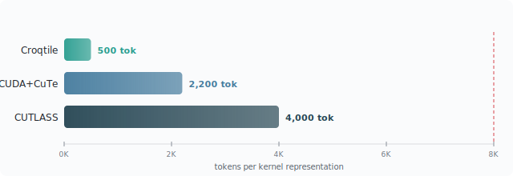

<p align="center">
  <strong>Croqtile</strong> &mdash; The AI-Native GPU Kernel Programming Language
</p>

<p align="center">
  <a href="https://croqtile.io">Website</a> &bull;
  <a href="https://lancerlab.github.io/croqtile-tutorial/tutorial/">Tutorial</a> &bull;
  <a href="https://lancerlab.github.io/croqtile-tutorial/documentation/">Docs</a> &bull;
  <a href="https://github.com/SyntaxArchmage/croqtile-playground">Playground</a>
</p>

---

Croqtile is built for AI agents that write and optimize GPU kernels. Token-compact source (~500 tokens per kernel), sub-second deterministic compilation, and 353 structured diagnostics with fix hints give agents a tight edit-compile-profile loop — no 30-90s device-hang debugging cycles, no wasted context on opaque errors.

Under the hood: a statically-typed, tile-oriented DSL compiled through SEMA → VALNO → INFER → CHECK → CODEGEN. Source programs express tiles, tensor views, TMA descriptors, and warp-cooperative schedules as first-class constructs. The compiler propagates symbolic shapes via value numbering, infers types and storage, verifies resource constraints (shared memory, register pressure, barrier budgets, async ordering), and emits target code (CUDA/CuTe SM 70-100, HIP RDNA 2+, portable C++) matching hand-tuned expert implementations.

## Why Croqtile

The core thesis: **the programming substrate is the first-order determinant of AI tuning quality.** A compact, orthogonal, compile-time-verified language lets agents spend their context budget on forward progress — not on error recovery, multi-site coordination, or debugging silent hardware hangs.

### Token Efficiency

Croqtile's syntax encodes structural intent (tile shapes, pipeline depth, warp roles) rather than mechanical boilerplate: ~500 tokens per kernel, where CUDA/CuTe requires ~2,200 and CUTLASS ~4,000. Fewer tokens on representation means more tokens for profiling data, optimization rules, and iteration history within a single context window.

<p align="center">
  
</p>

### Compiler–Harness Co-Design

Every tuning dimension (tile geometry, pipeline depth, swizzle mode, warp specialization, data type) is an orthogonal, single-site edit. The compiler closes the loop with immediate structured feedback: pass/fail + fix hint in 3-8 seconds. The agent never reasons about multi-site coupling — changing one knob cannot silently invalidate another.

Croqtile covers all ten GPU kernel tuning features with 1-3 code sites each; CUDA covers the same features at 3-8 sites per change. The quantitative result:

| DSL | pass@1 | pass@5 |
|-----|:------:|:------:|
| **Croqtile** | **85.7%** | **95.6%** |
| Triton | 84.3% | — |
| TileLang | 84.8% | — |
| CUDA | 35.3% | — |

Highest pass@1 among DSLs exposing warp-level controls, despite deeper structural edits that probe resource boundaries. On dynamic shapes, Croqtile drops only 4 pp (to 82.1%) while Triton falls to 48%, TileLang to 52%, and Helion to 45%.

The advantage is model-independent — it widens on moderate-capacity models:

| Model | Croqtile | Triton | TileLang | CUDA |
|-------|:--------:|:------:|:--------:|:----:|
| Opus 4.6 Max | 87.8% | 87.7% | 87.3% | 67.2% |
| DeepSeek M2.5 | 82.3% | 65.8% | 63.4% | 37.5% |

**Evaluation:** Claude Sonnet 4.6 High, NVIDIA H800 PCIe, 60-200 iterations/shape, identical system prompt and harness across all DSLs.

### Code Safety

353 compile-time checks across 7 verification modules catch bugs before code reaches the GPU — from tile shape mismatches and shared memory overflows to DMA configuration errors and async barrier misordering. Every rejection carries a structured diagnostic (violated constraint + symbolic derivation chain + repair hint) in fewer than 100 tokens, enabling one-shot correction.

The VALNO-based symbolic shape inference engine resolves shape constraints at compile time even when tensor dimensions are runtime values — propagating symbolic bounds through tile decomposition, reduction, and MMA chains. Dynamic workloads (variable batches, sequence lengths, MoE routing) get full compile-time safety where other DSLs defer to launch-time asserts or runtime crashes.

What gets caught at compile time:

| Bug class | Croqtile | Triton | TileLang | CUDA |
|-----------|:--------:|:------:|:--------:|:----:|
| Tile shape mismatch | **Yes** | Partial | **Yes** | **No** |
| Shared memory overflow | **Yes** | **No** | **No** | **No** |
| DMA/TMA config error | **Yes** | **No** | **No** | **No** |
| MMA shape/precision | **Yes** | **No** | **No** | **No** |
| Async barrier ordering | **Yes** | **No** | **No** | **No** |
| Out-of-bounds access | **Yes** | **No** | **No** | **No** |
| Dynamic shape constraint | **Yes** | **No** | **No** | **No** |
| Fix hint in error | **Yes** | **No** | **No** | **No** |

Notes: Triton checks `tl.dot` dimension ≥16 but not general tile shape consistency. Triton auto-inserts memory barriers (no user diagnostic). TileLang validates shapes at kernel launch via host stubs, not at compile time.

## What It Looks Like

A persistent warp-specialized GEMM — TMA, software pipelining, Hilbert-curve scheduling — in 25 lines:

```c
__co__ void matmul(global f16 [M, K] lhs, global f16 [N, K] rhs, global f16 [M, N] output,
                   global s32 [T] schedule_m, global s32 [T] schedule_n) {
  int total_tiles = cdiv(M, WARP_M) * cdiv(N, WARP_N);
  parallel block_id by NUM_SMS : block {
    shared f16 [WARP_M, TILE_K] lhs_s;
    shared f16 [WARP_N, TILE_K] rhs_s;
    shared f16 [WARP_M, WARP_N] out_s;
    foreach {tile_iter} in [cdiv(total_tiles, NUM_SMS)] {
      tile_id = tile_iter # block_id;
      if (tile_id < total_tiles) {
        int bm = schedule_m.at(tile_id);
        int bn = schedule_n.at(tile_id);
        mc = mma.fill.f16 0.0f;
        foreach {iv_k} in [cdiv(K, TILE_K)] {
          tma.copy.swiz<128> lhs.subspan(WARP_M, TILE_K).at(bm, iv_k) => lhs_s;
          tma.copy.swiz<128> rhs.subspan(WARP_N, TILE_K).at(bn, iv_k) => rhs_s;
          parallel p by 1 : group-4 {
            ma = mma.load.swiz<128> lhs_s;
            mb = mma.load.swiz<128> rhs_s;
            mma.row.row mc, ma, mb;
          }
        }
        mma.store mc, out_s;
        tma.copy out_s => output.subspan(WARP_M, WARP_N).at(bm, bn);
      }
    }
  }
}
```

| | Lines |
|--|-------|
| **Croqtile** | **25** |
| Triton | 64 |
| CUDA + CuTe | 182 |
| CUTLASS | 280 |

More examples (dynamic shapes, CroqPy, fused operators) at [croqtile.io](https://croqtile.io).

## Getting Started

### Prerequisites

- C++17 compiler (GCC 9.0+ or Clang 5.0+)
- CMake 3.18+ and Ninja
- Flex and Bison (parser generation)
- CUDA Toolkit 12.0+ (for the `cute` target)
- NVIDIA GPU with SM 9.0+ (Hopper) for full feature set

### Build from Source

```bash
make setup-core   # required on fresh clones: fetches submodules, toolchain, git hooks
make              # build compiler (Release, CMake + Ninja)
make test         # run full test suite
```

The build produces two binaries symlinked to the repo root:
- `./choreo` -- the compiler
- `./copp` -- the preprocessor

Other build variants:

```bash
make debug        # debug build with symbols (output: build-debug/)
make release      # explicit release build (output: build-release/)
make JOBS=4 test  # parallel test execution
make clean        # remove all build artifacts
```

### Compiler Usage

The compiler reads `.co` source files and lowers them through a multi-pass pipeline:

```
Source -> SEMA -> NORM -> VALNO -> INFER -> LATENORM -> CHECK -> CODEGEN -> Target
```

**Supported targets:**

| Target | Flag | Description |
|--------|------|-------------|
| CUDA/CuTe | `-t cute` | NVIDIA GPUs (SM 70+) |
| HIP | `-t hip` | AMD GPUs (RDNA 2+) |
| C++ | `-t cc` | Portable CPU code |

**Basic workflow:**

```bash
# Generate target source only (inspect without compiling)
./choreo -t cute -es program.co

# Generate a work-script that compiles and runs end-to-end
./choreo -t cute -gs program.co -o run.sh
bash run.sh --execute

# Or use the convenience script (auto-selects GPU, sets arch)
scripts/run_co_auto_gpu.sh program.co --arch sm_90a --disable-timing
```

**Key compiler flags:**

| Flag | Description |
|------|-------------|
| `-es` | Emit target source only (no target compilation) |
| `-gs` | Generate work-script (compile + run) |
| `-arch=ARCH` | Set target architecture (e.g., `sm_90a`, `native`) |
| `-fc` | Fast compile with cached precompiled CuTe runtime |
| `-rtc=LEVEL` | Runtime check level (`none`, `entry`, `low`, `medium`, `high`, `all`) |
| `-e` | Dump AST after parsing |
| `-i` / `-ii` | Show type inference results (with/without strides) |
| `-pa=PASS` | Print AST after a specific pass |
| `-sa=PASS` | Stop after a specific pass |
| `-v` | Verbose: show invoked programs |
| `--stats` | Print aggregate assertion/assessment statistics |
| `-zero-cost` | Zero-overhead mode: disable all runtime checks |

**Running tests:**

```bash
./tests/lit.sh tests/check/if_hoist.co   # single test file
./tests/lit.sh tests/check/              # entire directory
./tests/lit.sh -j4 tests/                # parallel full suite
```

For the complete reference, see the [Developer Guide -- Build and Test](./Documents/Developer/build-and-test.md).

## Documentation

| Level | Audience | Link |
|-------|----------|------|
| **Tutorial** | New users, hands-on learning | [Croqtile Tutorial](https://lancerlab.github.io/croqtile-tutorial/tutorial/) |
| **Language Reference** | Syntax and semantics | [Language Reference](https://lancerlab.github.io/croqtile-tutorial/documentation/) |
| **Developer Guide** | Compiler contributors | [Developer Guide](./Documents/Developer/index.md) |

## Ecosystem

| Project | Description | Link |
|---------|-------------|------|
| **Croqtile** | Compiler and runtime | This repo |
| **Tutorial** | Guided learning with examples | [lancerlab/croqtile-tutorial](https://lancerlab.github.io/croqtile-tutorial/) |
| **Playground** | Browser-based IDE (WASM compiler) | [SyntaxArchmage/croqtile-playground](https://github.com/SyntaxArchmage/croqtile-playground) |
| **Website** | Project website | [croqtile.io](https://croqtile.io) |

## Repository Structure

```
croqtile/
  lib/          Compiler source (parser, passes, codegen)
  runtime/      Runtime headers included by generated code
  tools/        Tool binaries (choreo, copp, co-mock)
  tests/        Test suite (lit-style with RUN: directives)
  samples/      Sample .co programs
  Documents/    Documentation (Language Reference, Developer Guide)
  scripts/      Build and CI scripts
```

## Contributing

```bash
make format       # format code (ClangFormat, LLVM-based)
make test         # run full test suite
```

See [Developer Guide -- Coding Style](./Documents/Developer/coding-style.md) for naming conventions and code patterns.

## License

Apache License 2.0. See [LICENSE](./LICENSE) for details.
