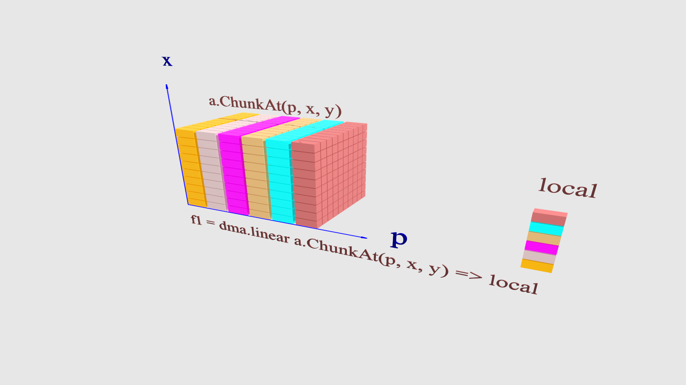

# Choreo - The C++ DSL for TileFlow Programming
Choreo is a low-level Embedded Domain Specific Language (**EDSL**) for C++ specifically engineered to program data movement entities like Direct-Memory-Accesses (DMA). 

Traditionally, programming DMA has focused on hardware configuration rather than the data itself. In modern heterogeneous hardware like GPUs, programmers often need to move smaller chunks of data to faster memory to enhance performance. This requirement can make programming more complex and sometimes results in hard-to-maintain code.

To address these challenges, Choreo is designed to simplify DMA programming by introducing a novel paradigm called **'TileFlow' programming**. It has already shown significant improvement on productivity, safety, and adaptibility over existing design, and is proven effective for building **high-performance machine learnig kernels** on heterogeneous hardware.

## Source-to-Source and End-to-End
In the current implementation, Choreo performs **source-to-source translation** to convert *choreo-c++* programs into vendor-supported C++ language code and APIs (such as Factor, Topscc, and CUDA).

Beside the translation, Choreo also integrates lower-level compiler in its compilation process. This makes Choreo appears as an **end-to-end compiler** when the vendor-provided device-level C++ compiler is properly configured.

## Features
### Productivity
One of the standout features of Choreo by design is its ability of **mind-set saving** in **data tiling** tasks. This is achieved by introducing domain specific types, which simplify data shape manipulation to a level comparable to *Python*. For instance: 
```cpp
__co__ f32 mdspan<2> my_function(f32 [8, 4, 12] d) {
    block_shape : d.span { (0)/ 2, (1)/ 4, 1, (2)};
}
```
With this code, programmers can effortlessly create a shape with a tiling factor of {2, 4, 1} from data 'd' and even add an extra dimension to the tiled 'block_shape', all in a single line. Furthermore, beside easy shape manipulation, the following code demostrates how Choreo simplify operations on DMA:
```cpp
  dma.copy input.chunkat(tiling_factors) => shared;
```
This code transfers a data chunk with specified tiling factors to a storage location named 'shared' via DMA. The explicit tiling in the code is easy to maintain, and the complexities of DMA configurations, index calculations, and storage management are handled implicitly by the Choreo compiler. The design allows programmers to concentrate on high-level strategies for building high-performance kernels.

### Code Safety
Another primary design goal of Choreo is to **ensure code safety** by catching errors at compile-time or as early as possible at runtime. To achieve this, Choreo employs **compile-time checks** and **runtime-check** based on the shapes and rules inferred from the *tileflow code*.

Bugs related to DMA are typically challenging to diagnose. However, with Choreo's safety checks, programmers can significantly reduce debugging efforts, thereby shortening the overall development cycle.

### Dynamic/Symbolic Shapes
Dynamic shape support is crucial for building many ML kernels. Choreo support and enhance the support via **symbolic shapes**, The symbolic shapes are determined at runtime but can still be checked statically or dynamically. The programmers can use it easily like the below code:

```
__co__ auto matmul(f32 [M, K] lhs, f32 [N, K] rhs) { ... }
```
This feature introduces a natural way to program shaped inputs, such as tensors. Additionally, symbolic shapes are also checked to ensure safety. This eliminates the need for many trivial, explicitly programmed assertions, thereby reducing boilerplate code.

### Visualization
**Analytic and visualization** is another compelling feature of Choreo, designed to help newcomers understand DMA behaviors. For instance, consider the following DMA statement:

`f1 = dma.copy a.chunkat(p, x, y) => local;`

With Choreo's visualization capability, programmers can observe the data movement resulting from this statement. The visualization might look something like this:



This is helpful for programmers escpecially for novices as visualization gives clear projection about the tiling behavior. Or else, programmers have to visualize in their mind, which is more error-prone.

# Documentation for Reference
Consult the [Choreo Documentation and Tutorials](http://10.31.50.149:8000/) document for information on building Choreo and the detailed usage.

